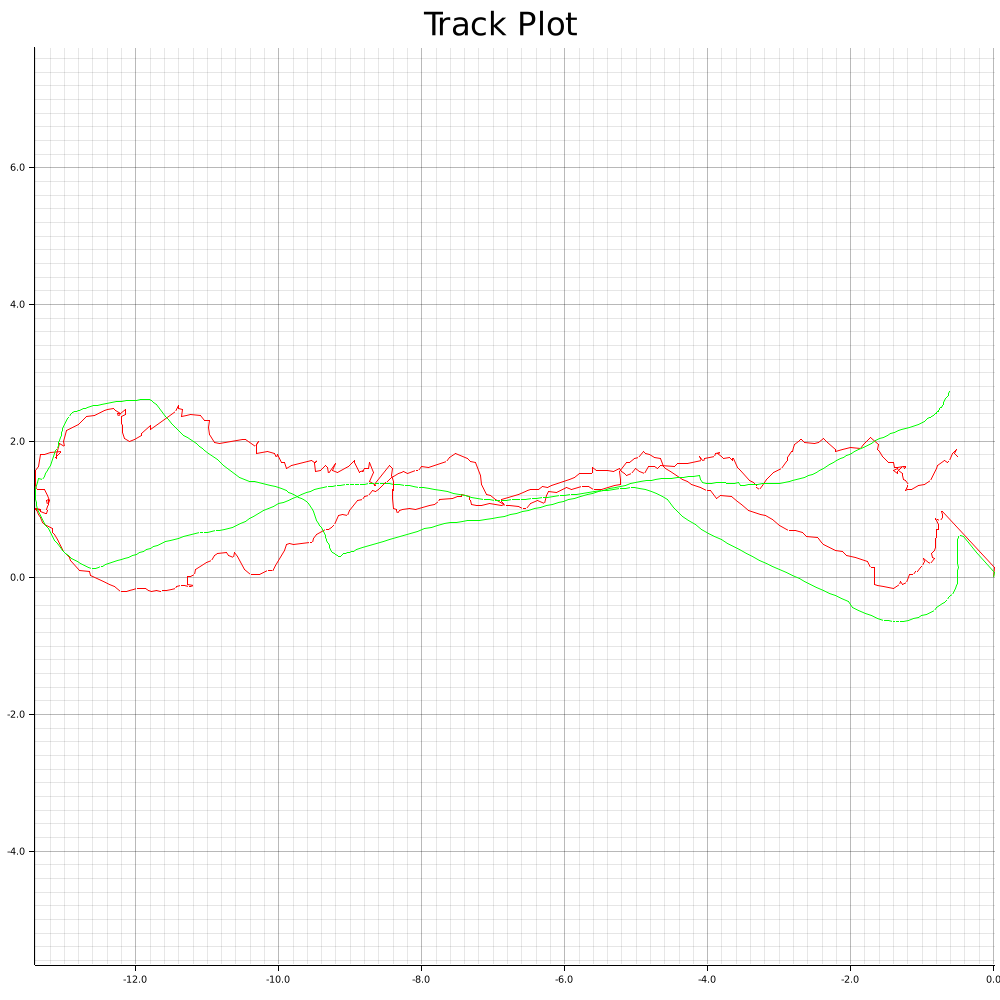

# raspberry_pi_localization
In this project I want to test the performance of a Kalman filter.
To achieve this, I built a robot controlled by the Raspberry Pi.

My plan was to create a drivable robot that would constantly track its position (using various sensors and a Kalman filter).
In the end, the resulting track should be compared to a ground truth (for now, I only have manual verification).

For example, I often tried to drive something like an eight and then look at the track to compare its similarity to an eight.

### The robot
The main workflow of how to use the robot is to drive around using a video game controller. 
Then in the end the calculated track is plotted and stored in a file so that someone can review it.

#### Controlling the robot
The robot is controllable via a video game controller that is connected with bluetooth.
The east button of the controller can be used to stop the tracking.

#### Sensors
I used the following sensors:
- GPS Sensor (position measurement)
- IMU Sensor (orientation and acceleration)
- Optical Flow Sensor (velocity)

For most of the sensors I needed to write my own driver since I was using rust (this was on purpose).
Therefore, I believe there are some bugs in my code. Although, I was quite happy with the measurements.

### My findings
In most of my runs, I started somewhere, then drove around a table and back to where I started.
So the resulting shape should have some similarity to a balloon.
Below are some example tracks I got on my runs.

Example of a good track:

Example of a bad track:

As you can see in the good track I have the desired balloon-shape (quite accurately). 
But in the bad track I have more of a U-shape. 

So there seems to be some offset between the way to the table and the way back from the table.
And I had this U shape quite a lot. It seems that the GPS sensor has some problems depending on the
with the direction I was going.

But I am still quite happy with the results. In particular, the Kalman filter implementation worked 
quite well. For example, I once set the optical flow error to 0, and then I could see the
balloon shape as well as the drift.

### Future
I would be interested in testing other sensors in the future. 
For example, I would be very interested to see how a LiDAR sensor would affect the system. 
Especially since the current system relies quite heavily on the GPS sensor, 
it would be interesting to see what effect that would have.

### Authors
Frederik Böcker